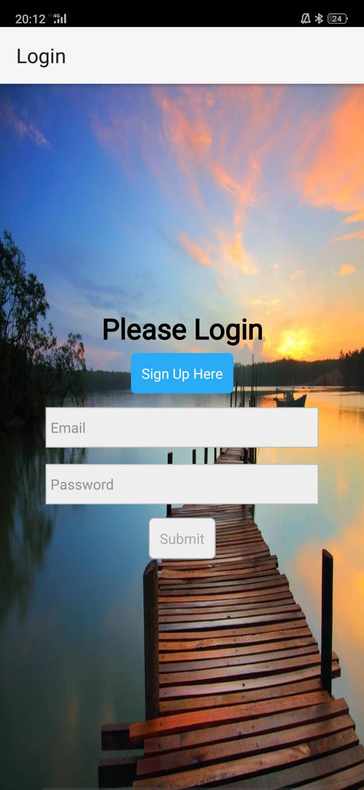
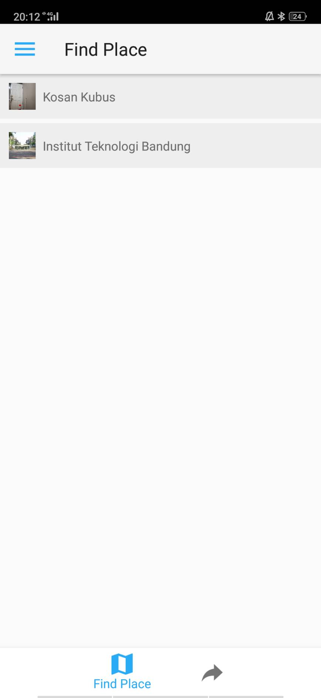
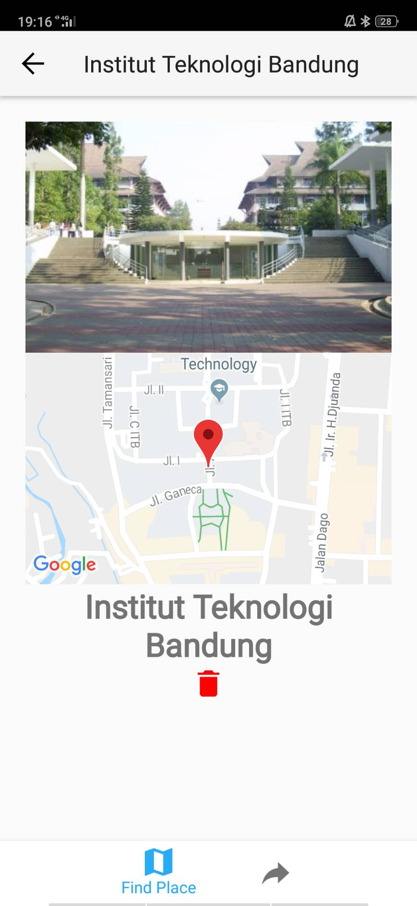
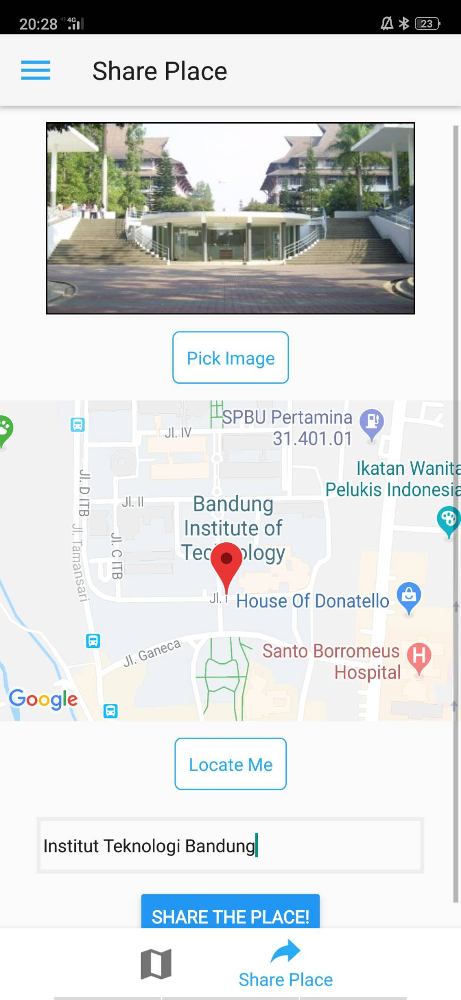

# Place Finder App

An application that can be used to share or find exciting places around the world. Powered by Google Maps API and built with React Native.

#### Get the APK

You can get the APK from [here](https://drive.google.com/file/d/1FzW9yIXclL4BA3Jo4QO0uJFnWq8kgpH8/view).

Simply install it in your Android device by double clicking it.

(Side Note : This project should be working on iOS too but I haven't got anychances to do it since I don't use iOS product)

#### How To Run

1. Clone this project and install all dependencies by running `npm install`.
2. You will need react-native cli to run this program. More info [here](https://facebook.github.io/react-native/docs/understanding-cli).
3. Run `react-native run-android` to run it on Android devices and `react-native run-ios` to run it on iOS devices.
4. That's it, your app should be working fine.

#### Screenshots

